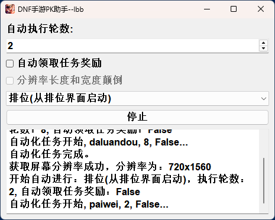

# DNF手游助手-lbb

## 简介
可以自动完成dnfm的决斗任务以及活动任务，不在意胜率者可用。基本原理为按固定的流程自动循环通过adb点击相关的坐标。

## 运行截图

### 工具主界面


### 排位开始


## 使用方法
1. 手机打开usb调试，通过usb连接到主机；
2. 【win环境可选】打开`bin/QtScrcpy.exe`程序,此程序可通过投屏界面查看和控制手机。
3. 在程序界面设置游戏模式和自动进行轮数。
4. 【重要】打开手机游戏并调整到游戏模式对应的页面，不在对应的页面开始执行可能会误点击。
5. 点击程序界面开始按钮，等待自动运行完成。
6. 【可选】若需要提前终止，可点击程序界面停止按钮。

## 程序运行

### 环境要求

- **Python**：3.8 及以上版本
- **操作系统**：Windows, macOS, 或 Linux
- **依赖包**：详见 `requirements.txt`
- **额外工具**：macOS 或 Linux 需要安装 ADB（Android Debug Bridge）

### 步骤

1. **克隆或下载项目**


2. **安装依赖**：

   ```sh
   pip install -r requirements.txt
   ```

3. **安装 ADB**（仅 macOS/Linux）：

   请根据你的操作系统安装 ADB。

   - **macOS**：

     ```sh
     brew install android-platform-tools
     ```

   - **Linux**：

     ```sh
     sudo apt-get install android-tools-adb
     ```

### 运行程序

```sh
python main.py
```

### 注意事项

- 在运行程序之前，请确保已连接相应的设备，并且 ADB 正常工作。
- 如果遇到任何问题，请检查是否已正确安装所有依赖，并确保使用的是 Python 3.8 及以上版本。

## 打包方法
Windows平台：
```
pyinstaller.exe dnfm_assistant.spec
# 还需要手动将bin文件夹拷贝到执行文件目录下
```

其他平台参考Windows自行修改，其他平台不需要`bin`文件夹。

## 致谢

在我们的项目中，我们使用了 [QtScrcpy](https://github.com/barry-ran/QtScrcpy) 工具的 release 文件。我们对 `QtScrcpy` 的开发者 Barry Ran 表示由衷的感谢。

## 许可证

本项目采用 [GNU 通用公共许可证 (GPL) v3.0](https://www.gnu.org/licenses/gpl-3.0.html) 许可。您可以自由地使用、修改和分发本项目的代码，但是任何基于本项目的修改或衍生作品必须同样在 GPL 许可证下发布。

